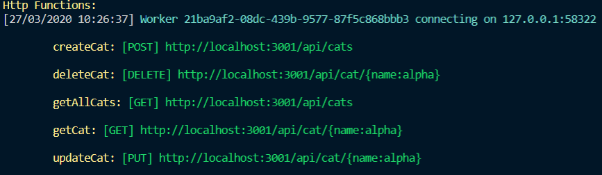

# Neo4j MEAN API - remote version
The simplest way to test the app - and API - is using the remote version, deployed on Microsoft Azure and publicly accessible through the Internet.

To access this version, [head over to the app](https://neo4j-mean-front.azurewebsites.net).

Otherwise, continue to the next section of this guide.

# Neo4j MEAN API - local version
You can also deploy it locally. To do so, follow the instructions below.

## Requirements
You need to have installed :
* Node.js version 12 LTS from [here](https://nodejs.org/en/download/).
* Azure Functions Core Tools. To install it, execute the following command :
```bash
npm install -g azure-functions-core-tools
```

## Start Azure Functions
Azure Functions Core Tools enables you to execute your Functions runtime locally. To do so, execute the following command :
```bash
func start
```
If everything is working properly, you should get the following CLI output :

To verify that the API is working properly, go to the following URL : <http://localhost:3001/api/cats>.

### Note on potential errors
Depending on the configuration of your machine, you might need to install the [.NET Core 2.x SDK](https://dotnet.microsoft.com/download).

This is because Functions are built on top on .NET Core. When you start the Functions runtime, it spins up a .NET Core runtime, in which the desired runtime of your functions - Node.js in our case - runs.

You normally don't need this with this project, as we make use of the extensions bundle. But just in case, here's a warning...
